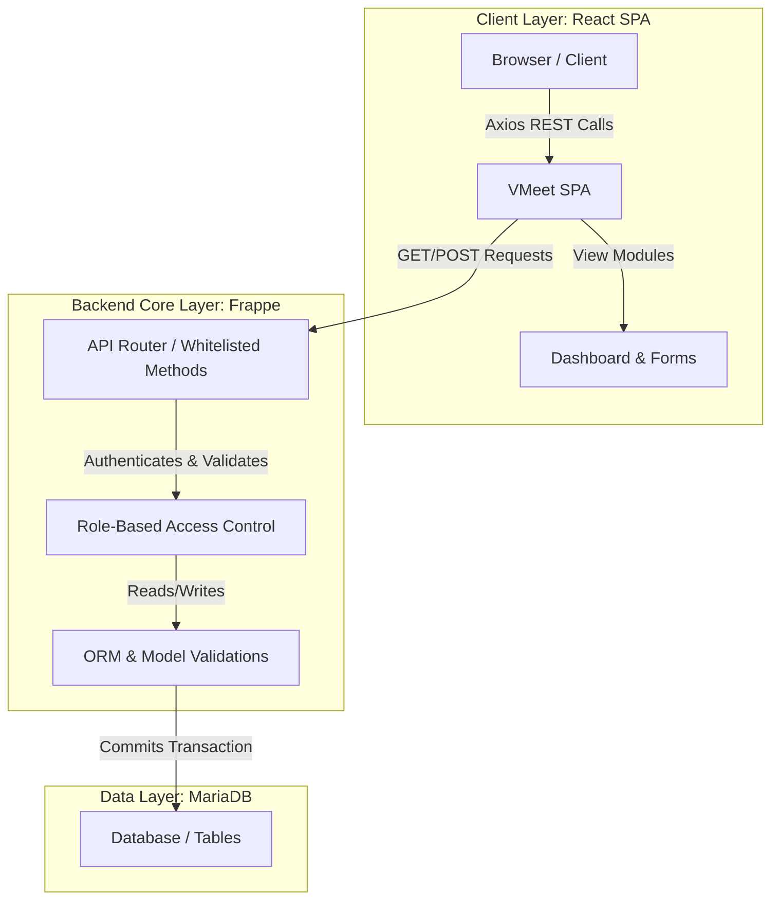
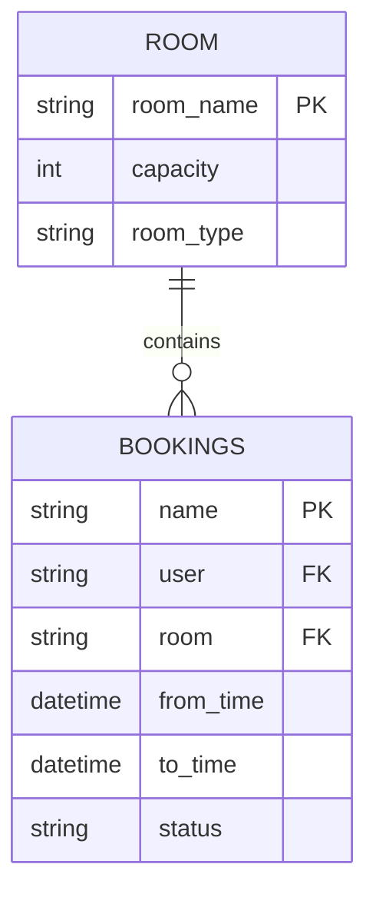

# VMeet — API & Architecture Documentation

This document contains complete API specifications, system architecture, DB schema, component hierarchy, and development assumptions for the **VMeet Meeting Room Booking App**.

> [!NOTE]
> The full Swagger OpenAPI 3.0 specification is available in the [openapi.yaml](openapi.yaml) file.


---

## 🏗️ System Architecture

VMeet is built as a decoupled but highly integrated system using the **Frappe Framework** as the backend API/persistence layer and **React** for the user interface.

### Architectural Blueprint


### Monolithic vs. Microservice/Modular Backend
Frappe acts as a **monolithic backend** providing multi-tenant security, session/auth handling, and an active ORM out of the box. However, it can be viewed as exposing specialized, distinct **service components** (or modular microservices) for specific operations:
1. **Auth Service**: Native Frappe session & CSRF management.
2. **Room Service**: Native Frappe REST (`/api/resource/Room`) handles CRUD.
3. **Booking & Reservation Service**: Custom controllers validate bookings & prevent slot overlapping before scheduling.

---

## 🗂️ React Frontend Component Hierarchy

The frontend is built with React 18 and Vite. Below is the file structure and component hierarchy:

```
src/
 ├── App.jsx                   # Main Router & Provider Initialization
 ├── api.js                    # API client with Axios (Base URL, CSRF hooks)
 ├── main.jsx                  # React DOM Root hydration
 ├── assets/                   # Static SVG icons and styles
 ├── components/
 │    ├── Layout.jsx           # Main App shell (Sidebar, active user state display)
 │    ├── Dashboard.jsx        # Component for listing rooms & statistics
 │    ├── BookingForm.jsx      # Reusable room reservation form
 │    ├── MyBookings.jsx       # Tabular view of specific user's bookings
 │    └── Navbar.jsx           # Top header navigation & Profile access
 └── pages/
      ├── Dashboard.jsx        # Room listing, filters, and dynamic search
      ├── BookRoom.jsx         # Handles selecting dates, slots, and validation
      ├── MyBookings.jsx       # User's booking history & cancel actions
      ├── AdminBookings.jsx    # Status modification (Approve/Reject) [Admin Only]
      ├── ManageRooms.jsx      # Creation/Deletion of meeting rooms [Admin Only]
      └── Profile.jsx          # Current user session display
```

---

## 📊 Database Schema & Data Models

Frappe stores Data Models using **DocTypes**. VMeet relies on two main custom DocTypes:

### 1. `Room` DocType
Defines physical meeting room properties.

| Field Name | Type | Options / Validation | Description |
|---|---|---|---|
| `room_name` | Data | Unique, Required | The display name of the room |
| `capacity` | Int | Min: 1 | Number of occupants allowed |
| `room_type` | Select | `Conference`, `Cabin`, `Open Space` | The classification of space |



### 2. `Bookings` DocType
Links users with physical spaces for specific durations.

| Field Name | Type | Options / Validation | Description |
|---|---|---|---|
| `user` | Link | `User` (Required) | Reference to current session user |
| `room` | Link | `Room` (Required) | Reference to meeting room |
| `from_time`| Datetime| Must be before `to_time` | Start of booking slot |
| `to_time` | Datetime| Must be after `from_time` | End of booking slot |
| `status` | Select | `Pending`, `Approved`, `Occupied`, `Free To Use` | Lifecycle tracking |

**Important Backend Verification Hook:** Before any record is written, a script ensures that `from_time < to_time` and executes the query below to prevent overlap:
```python
existing_bookings = frappe.db.get_list('Bookings', filters={
    'room': room,
    'status': ['!=', 'Cancelled'],
    'name': ['!=', current_name]
})
```

---

## 🔌 API Endpoint Specifications

The following table lists the APIs used by the frontend to communicate with the Frappe backend.

### 1. Retrieve Current User Session Info
Returns current user's profile information and admin privileges.

- **Method:** `GET`
- **URL:** `/api/method/v_meet.v_meet.api.get_current_user_info`
- **Headers:** `X-Frappe-CSRF-Token`
- **Example Response:**
```json
{
  "message": {
    "user": "Administrator",
    "is_admin": true
  }
}
```

### 2. Create Room (Admin Only)
Saves a new meeting room record in the database.

- **Method:** `POST`
- **URL:** `/api/resource/Room`
- **Payload:**
```json
{
  "room_name": "Saturn Boardroom",
  "capacity": 15,
  "room_type": "Conference"
}
```
- **Example Response:**
```json
{
  "data": {
    "name": "Saturn Boardroom",
    "room_name": "Saturn Boardroom",
    "capacity": 15,
    "room_type": "Conference"
  }
}
```

### 3. Fetch All Rooms
Returns a list of all meeting rooms.

- **Method:** `GET`
- **URL:** `/api/resource/Room?fields=["name","room_name","capacity","room_type"]`
- **Example Response:**
```json
{
  "data": [
    {
      "name": "Saturn Boardroom",
      "room_name": "Saturn Boardroom",
      "capacity": 15,
      "room_type": "Conference"
    }
  ]
}
```

### 4. Create Booking Request
Allows authenticated users to reserve a room.

- **Method:** `POST`
- **URL:** `/api/resource/Bookings`
- **Payload:**
```json
{
  "user": "ajith@example.com",
  "room": "Saturn Boardroom",
  "from_time": "2026-05-01 14:00:00",
  "to_time": "2026-05-01 16:00:00",
  "status": "Pending"
}
```
- **Example Response:**
```json
{
  "data": {
    "name": "BKG-0001",
    "user": "ajith@example.com",
    "room": "Saturn Boardroom",
    "from_time": "2026-05-01 14:00:00",
    "to_time": "2026-05-01 16:00:00",
    "status": "Pending"
  }
}
```

### 5. Update Booking Status (Admin Only)
Modifies the status of a specific booking.

- **Method:** `POST`
- **URL:** `/api/method/v_meet.v_meet.api.update_booking_status`
- **Payload:**
```json
{
  "booking_name": "BKG-0001",
  "status": "Approved"
}
```
- **Example Response:**
```json
{
  "message": {
    "name": "BKG-0001",
    "status": "Approved"
  }
}
```

---

## 💡 Development & Business Assumptions

1. **Authentication:** All users logging into the React SPA are assumed to have a valid active Frappe session cookie.
2. **Timezone Context:** The datetime timestamps passed between the frontend and the backend are in local server/system timezone format.
3. **Roles:** Any user matching `Administrator` possesses elevated permissions to approve, reject, or modify booking requests.
4. **Data Isolation:** Standard users are gated both on UI views and backend queries to filter out unauthorized data where necessary.
